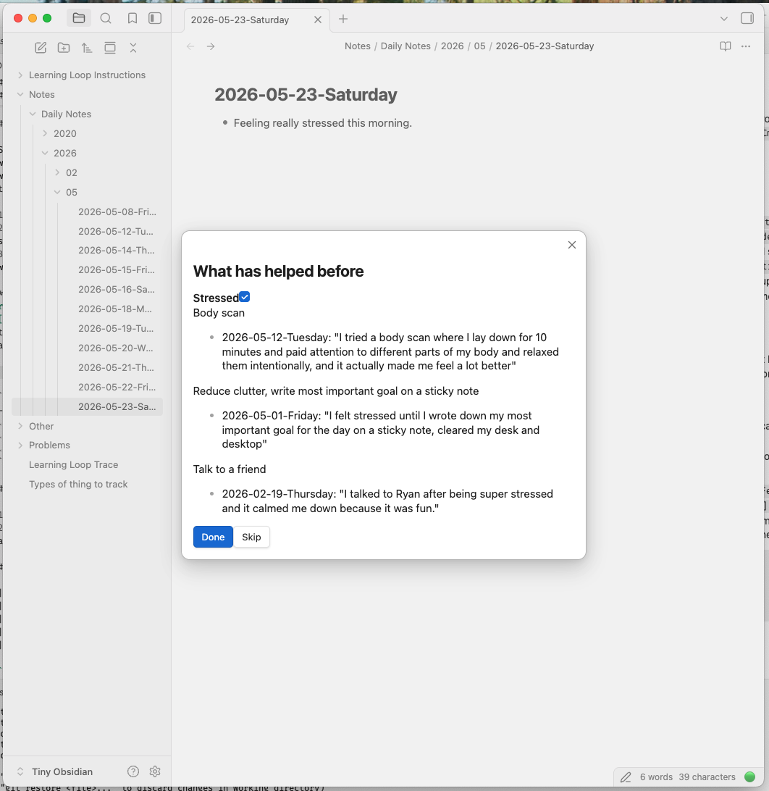

# Learning Loop

**tl;dr** Activate this plugin in Obsidian, write a note describing a problem you're facing (and optionally a solution that has worked for you), press `Cmd+L`, choose **Help** or **Log**, and the plugin will help you to build a library of problems **you've** faced and solutions that have worked for **you**, instead of generic AI slop. (More description and help on setup below.)

## Overview

An Obsidian plugin for building a personal library of problems you recurrently face (e.g., Stress, Indecision, Lack of Motivation, etc.) and solutions you've found for them (e.g., Go for a walk, Journal for 20 minutes, etc.) — and helping you immediately find the best solutions to those problems in the moment you actually face them.

## How it works

You write notes in Obsidian describing what problems you face and what solutions are working / not working for you. The plugin uses AI to help you to automatically organize these notes to build the library mentioned above.

The plugin revolves around a `Problems/` folder in your vault ([?](https://obsidian.md/help/vault#:~:text=A%20vault%20is%20a%20folder%20on%20your%20local%20file%20system%20where%20Obsidian%20stores%20your%20notes.)). Each file in it tracks a recurring difficulty and what's worked (or hasn't) for you personally.

You run the plugin by pressing `Cmd+L` after selecting or writing text in your notes, and then choosing **Help** or **Log**, the two functions of the plugin so far. Here's what they do:

### 1. Log

The text you selected or wrote in your notes describes a problem you solved and how (any note works, but your Daily Note is a good default place to write). Given this, when you press `Cmd+L` and choose **Log**, the plugin will:

1. Parse your note text to extract both the problem and what you did to solve it
2. Show you the result to confirm or edit (did it get the problem and the solution right? Correct it if necessary)
3. Write the entry to the appropriate `Problems/` file and solution section therein

**Example:** On May 1, 2026, you write in a note "I felt stressed until I wrote down my most important goal for the day on a sticky note, cleared my desk and desktop". You press `Cmd+L` and click **Log**. The system shows you its proposal for the general problem and solution you've described (problem: `Stress`, solution: `Reduce clutter, write most important goal on a sticky note`), and once you edit/accept and click `Log it`, your `Problems/Stress.md` page is updated with that solution and a reference to today's note, which describes concrete evidence of the efficacy of that solution. Now you have more data on how to best solve your Stress.

### 2. Help

Sometimes you're in the thick of the problem, though, and you want help deciding what to do for a problem you've already tried solutions for and logged that data to your Problems library. In this case, you write what's going on/what you're experiencing, press `Cmd+L`, click **Help**, and the plugin will:

1. Identify which problem is closest to your current situation
2. Surface what it considers to be relevant pages from your `Problems/` folder where you can find solutions that have worked for you in the past. If you click "Accept" on a page, it proceeds to:
3. Summarize the solutions you've found to work in the past and quote what you wrote about the moments where they worked.

**Example:** Later in the month, on May 23, 2026, you write in a note `Feeling really stressed this morning.` You press `Cmd+L` → Help. You're shown `[[Stress]]` as a relevant page, and the solutions that have worked for you in the past (including the one from the example above on May 1, 22 days earlier) are summarized for you, using the language you generated and approved of.



Also, a `Learning Loop Trace` block now envelops the cue you typed and what the plugin linked to, so you have persistent and immediate access to the pages it linked to. 

```
- [[Learning Loop Trace]]
	- Feeling really stressed this morning.
	- [[Stressed]]
```

Because there is a reference to the [[Learning Loop Trace]] page, this additionally allows you to find a collected list of all the times you've used this approach, collected in one place in the `Linked References` section of the [[Learning Loop Trace]] page.

## Setup

1. Open Obsidian (see footnote 1 if you haven't installed it yet)
2. Install Learning Loop from the [community plugins browser](https://obsidian.md/plugins?id=learning-loop), or clone it manually into your vault's `.obsidian/plugins/` folder (see footnote 2 if you don't know how to do this)
3. Enable Learning Loop by clicking Settings (see footnote 3 if you don't know where this is) → Community Plugins
4. Add your Anthropic API key in Settings → Learning Loop (see footnote 4 if you don't know where this is)
5. Type a problem you often face and a solution that has worked for that problem. Press `Cmd+L` and click **Log** — the `Problems/` folder (and a problem page corresponding to that problem) is created automatically when you first log something

---
## Footnotes
**1 — Installing Obsidian:** Download Obsidian at https://obsidian.md/download and run the installer.

**2 — Installing the plugin manually via git clone:** Open a terminal (Mac: press `Cmd+Space`, type `Terminal`, press `Enter` — Windows: press `Win+R`, type `cmd`, press `Enter`). Then run the following commands, replacing `<path-to-vault>` with the path to your vault folder on disk (see footnote 5):

```
#If you've never been in a terminal, you type each line below and press enter to run it.

cd <path-to-vault>/.obsidian/plugins 
git clone https://github.com/chrisrytting/learning-loop-obsidian.git learning-loop
```
**3 — Finding your settings:** In Obsidian, click the gear icon in the bottom left, or in the Obsidian menu at the top left in the system menu bar, and then click Settings.

**4 — Finding your Anthropic API key:** Go to [Anthropic](https://console.anthropic.com/), click on your user icon in the top right, and then click "API Keys". Create a new key if you don't have one yet, copy it, and paste it into the API key field in Settings → Learning Loop.

**5 — Finding your vault path:** In Obsidian, go to Settings → About — the full path is shown under *Vault path*. Alternatively: on Mac, drag your vault folder into a Terminal window and the path will be pasted automatically. On Windows, open File Explorer, navigate to your vault folder, and copy the address bar.
